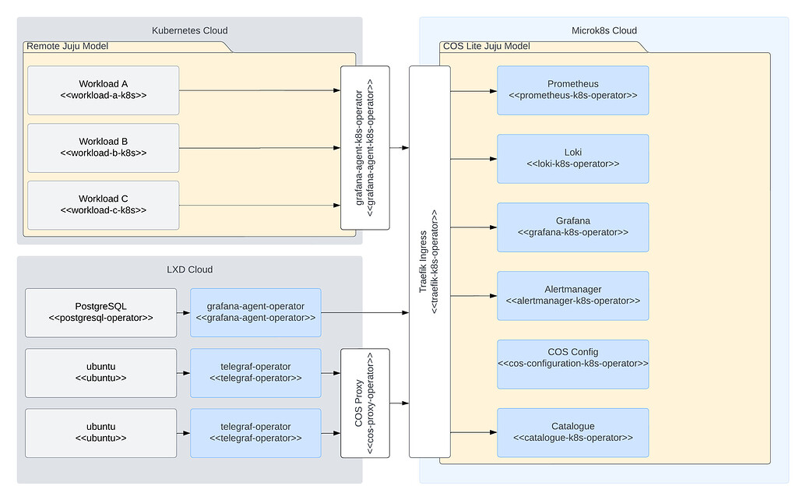

# Telemetry Flow

## COS Lite

COS Lite includes Loki, a logs backend, and Prometheus, a metrics backend. The API endpoints of Loki and Prometheus are communicated to other charms via Juju integrations. This way, telemetry producers (or aggregators) are able to push telemetry to Loki and Prometheus.

Prometheus is also able to pull metrics directly from metric providers. However, this is not generally advisable over model or substrate boundaries. In the recommended deployment scenarios, a telemetry aggregator, such as Grafana Agent, is used to funnel logs and metrics to COS.

In this case, Grafana Agent takes over the responsibility to push logs as well as metrics into COS: so it’s not required for the COS stack to be able to reach the Grafana Agent, but the agent must be able to reach the COS stack.

The Grafana Agent needs to be able to reach the charms and workloads generating the telemetry, and the other way around. 

The image below describes a typical COS Lite deployment observing both a LXD- and a Kubernetes cloud. In the following sections, you’ll find a brief summary of the use case of each of the components that make up a data path between a telemetry emitter and COS itself.

## COS

COS includes Mimir, a distributed metrics backend, Loki, a distributed logging backend, and Tempo, a distributed tracing backend. For all intents and purposes, COS provides the same telemetry flows as COS Lite, but with two key differences: traces flowing from the agents to Tempo, and Mimir - in contrast to Prometheus - not being capable of scraping on it's own but instead relying on having the telemetry pushed to it.

## Auxiliary Charms

### COS Proxy

The COS Proxy bridges the gap between workloads instrumented using NRPE, allowing it to be turned into metrics stored as time series in Prometheus. This charm is meant to serve as a stepping stone, and not as a future-proof solution. Going forward, all charms built by Canonical will instead expose metrics directly, allowing users to omit the proxy.

### Grafana Agent

The Grafana Agent machine charm aims to collect both host and application telemetry in deployment scenarios where a full virtual machine is being used. It is powered by the `grafana-agent` snap, and handed a configuration containing all scrape targets available on the machine, including a `node_exporter` endpoint provided by the snap itself.

### Grafana Agent K8s

The Grafana Agent K8s charm is analogous to the machine ditto but deployed in a K8s pod. In contrast to the machine charm, the K8s charm is not installed in the same container as the workload, which means scraping or log forwarding happens between pods rather than in-pod.

### Prometheus Scrape Config

`prometheus-scrape-config` is a workload-less charm used to alter the configuration of individual scrape jobs. It is commonly used to modify the scrape interval of the cos-proxy NRPE checks, as triggering an involved bash script once every minute has the potential of degrading system performance.

In a typical OpenStack + COS deployment, there are multiple of these with different scrape intervals, depending on the part of the system you are monitoring.