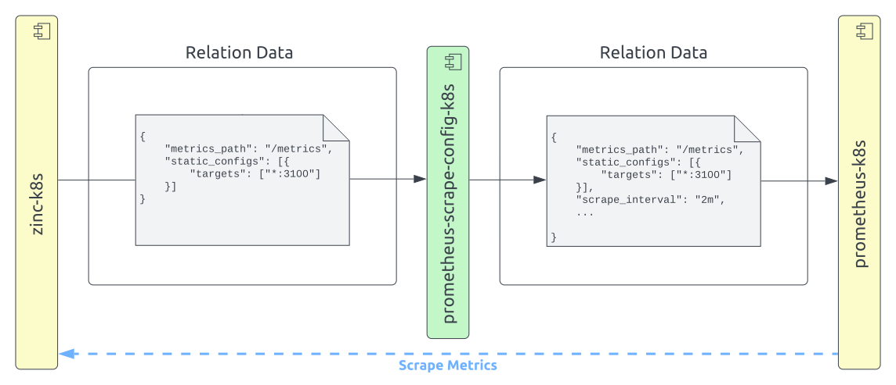

# Configure Prometheus scrape jobs

By default, the Prometheus charm allows for minimal configuration of the 
scrape jobs created when you relate it to a remote charm. Instead, we 
chose to put it in an adapter/config charm, allowing for it to be used 
when there is a need without adding complexity to the general use case. 

This has the added benefit of making it crystal clear while glancing the 
model to identify whether something is deviating from the defaults.


## Deploy the Scrape Config charm

Deploying the [Prometheus Scrape Config charm](https://charmhub.io/prometheus-scrape-config-k8s) charm is accomplished through a single command. Here, we'll 
deploy it from the edge channel:

```bash
$ juju deploy prometheus-scrape-config-k8s --channel latest/edge
```

Then relate it to the application you want to scrape, in this case 
[the Zinc charm](https://charmhub.io/zinc-k8s), as well as to Prometheus itself:

```bash
$ juju relate prometheus-scrape-config-k8s zinc-k8s
$ juju relate prometheus-scrape-config-k8s prometheus-k8s
```

With that done, you'll now be able to tweak the configuration of the scrape job.

## Available options

For a list of configuration options and explanations about what they do as well as what their defaults are, run the `juju config` command without any configuration option:

```
$ juju config prometheus-scrape-config-k8s
```

## Changing the Configuration

Let's go ahead and have a look at how our scrape job currently looks:

```bash

$ juju show-unit prometheus-k8s/0

...
    
"scrape_jobs": [{
    "metrics_path": "/metrics",
    "static_configs": [{
        "labels": {
            "juju_model": "cos",
            "juju_model_uuid": "c3d3aa50-aefc-4511-8a0a-af825c838b64",
            "juju_application": "zinc-k8s",
            "juju_charm": "zinc-k8s",
            "juju_unit": "zinc-k8s/0"
        },
        "targets": [
            "10.1.14.39:3100"
        ]
    }],
    "job_name": "juju_cos_c3d3aa50_zinc_k8s_prometheus_scrape",
    "relabel_configs": [{
        "source_labels": [
            "juju_model",
            "juju_model_uuid",
            "juju_application",
            "juju_unit"
        ],
        "separator": "_",
        "target_label": "instance",
        "regex": "(.*)"
    }]
}]
```

Then, we will set the `scrape_interval` in the prometheus-scrape-config-k8s charm:

```bash
$ juju config prometheus-scrape-config-k8s scrape_interval=2m
```

Let's have a look again:

```bash
    
$ juju show-unit prometheus-k8s/0

...

"scrape_jobs": [{
    "metrics_path": "/metrics",
    "static_configs": [{
        "labels": {
            "juju_model": "cos",
            "juju_model_uuid": "c3d3aa50-aefc-4511-8a0a-af825c838b64",
            "juju_application": "zinc-k8s",
            "juju_charm": "zinc-k8s",
            "juju_unit": "zinc-k8s/0"
        },
        "targets": [
            "10.1.14.39:3100"
        ]
    }],
    "job_name": "juju_cos_c3d3aa50_zinc_k8s_prometheus_scrape",
    "relabel_configs": [{
        "source_labels": [
            "juju_model",
            "juju_model_uuid",
            "juju_application",
            "juju_unit"
        ],
        "separator": "_",
        "target_label": "instance",
        "regex": "(.*)"
    }],
    "scrape_interval": "2m"
}]
```


Notice how the last part of our scrape job changed? We are now sending a 
non-default `scrape_interval` to Prometheus! If we visualize our deployment 
as a diagram, it will now instead look like this:


