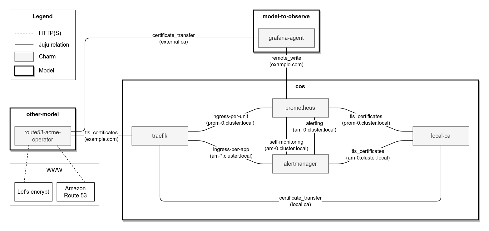

# TLS encryption in COS


## COS

COS can be deployed end-to-end encrypted, with TLS termination only, or unencrypted. When deploying COS using [the provided Terraform module](https://github.com/canonical/observability-stack/tree/main/terraform/cos), it will by default be deployed using a self-signed certificate authority. If you have other certificate requirements, you'll be able to replace the self-signed-certificates operator with another TLS operator of your liking, consulting the "Providing" section of [the `tls-certificates` interface page on Charmhub](https://charmhub.io/integrations/tls-certificates).

TODO For help with deploying COS using Terraform, see the [tutorial/installation docs](../tutorial/installation).

`````{tab-set}
````{tab-item} End-to-end TLS
:sync: e2e-tls-cos

The following Terraform root module enables internal TLS by setting `internal_tls` value to `true`. By instantiating the COS module with a `certificates` provider offer URL (from the `ssc` module in this example), Traefik is provided certificates to enable TLS termination. The combination of these settings enables end-to-end TLS.

```{tip}
- `internal_tls` -> `true`
- `external_certificates_offer_url` -> not `null`
```

```{literalinclude} /how-to/cos-tls.tf
```
````

````{tab-item} TLS-terminated
:sync: tls-terminated-cos

To remove the internal TLS configuration, override the COS module's `internal_tls` value to `false`. By instantiating the COS module with a `certificates` provider offer URL (from the `ssc` module in this example), Traefik is provided certificates to enable TLS termination. The combination of these settings enables TLS termination.

```{tip}
- `internal_tls` -> `false`
- `external_certificates_offer_url` -> not `null`
```

```{literalinclude} /how-to/cos-tls.tf
```
````

````{tab-item} Unencrypted
:sync: unencrypted-cos

To remove the internal TLS configuration, override the COS module's `internal_tls` value to `false`. To remove TLS termination, override the COS module's `external_certificates_offer_url` to `null`. The combination of these settings enables unencrypted mode.

```{tip}
- `internal_tls` -> `false`
- `external_certificates_offer_url` -> `null`
```

```{literalinclude} /how-to/cos-tls.tf
```
````
`````

## COS Lite

COS Lite can be deployed via Terraform or with Juju bundles. In either case, it can be deployed end-to-end encrypted, with TLS termination only, or unencrypted.

``````{tab-set}
`````{tab-item} Terraform
:sync: tf-tls-cos-lite

TODO For help with deploying COS using Terraform, see the [tutorial/installation docs](../tutorial/installation).

`````{tab-set}
````{tab-item} End-to-end TLS
:sync: e2e-tls-cos-lite

The following Terraform root module enables internal TLS by setting `internal_tls` to `true`. By instantiating the COS Lite module with a `certificates` provider offer URL (from the `ssc` module in this example), Traefik is provided certificates to enable TLS termination. The combination of these settings enables end-to-end TLS.

```{tip}
- `internal_tls` -> `true`
- `external_certificates_offer_url` -> not `null`
```

```{literalinclude} /how-to/cos-lite-tls.tf
```

````

````{tab-item} TLS-terminated
:sync: tls-terminated-cos-lite

To remove the internal TLS configuration, override the COS Lite module's `internal_tls` value to `false`. By instantiating the COS Lite module with a `certificates` provider offer URL (from the `ssc` module in this example), Traefik is provided certificates to enable TLS termination. The combination of these settings enables TLS termination.

```{tip}
- `internal_tls` -> `false`
- `external_certificates_offer_url` -> not `null`
```

```{literalinclude} /how-to/cos-lite-tls.tf
```
````

````{tab-item} Unencrypted
:sync: unencrypted-cos-lite

To remove the internal TLS configuration, override the COS Lite module's `internal_tls` value to `false`. To remove TLS termination, override the COS Lite module's `external_certificates_offer_url` to `null`. The combination of these settings enables unencrypted mode.

```{tip}
- `internal_tls` -> `false`
- `external_certificates_offer_url` -> `null`
```

```{literalinclude} /how-to/cos-lite-tls.tf
```
````
`````

`````{tab-item} Bundle
:sync: bundle-tls-cos-lite

````{tab-set}
```{tab-item} End-to-end TLS
:sync: e2e-tls-cos-lite

The cos-lite bundle together with the TLS overlay deploy an end-to-end encrypted COS.
- COS charms generate CSRs with the K8s FQDN as the SAN DNS and the internal CA signs.
- All COS charms trust the internal CA by installing the CA certificate in the charm and workload containers, using the `update-ca-certificates` tool.
- The external CA provides a certificate for Traefik's external URL.
- Within the COS model, workloads communicate via K8s FQDN URLs.
- Requests coming from outside of the model, use the ingress URLs.
- Traefik is able to establish a secure connection with its proxied apps thanks to trusting the local CA.

Note: currently there is a [known issue](https://github.com/canonical/operator/issues/970) due to which some COS relations are limited to in-cluster relations only.

The end-to-end COS TLS design is described in the diagram below. The diagram is limited to prometheus and alertmanager for brevity and clarity.



As with any TLS configuration, keep in mind best practices such as frequent certificate rotation.  See [this guide](https://charmhub.io/blackbox-exporter-k8s/docs/monitor-ssl-certificates) for an example of monitoring certificates.
```

```{tab-item} TLS-terminated
:sync: tls-terminated-cos-lite

The Traefik charm can function as a TLS termination point by relating it to an external CA (integrator) charm. Within the COS model, charms would still communicate using plain HTTP (unencrypted).
```

```{tab-item} Unencrypted
:sync: unencrypted-cos-lite

The [cos-lite bundle](https://charmhub.io/cos-lite) deploys COS with workloads communicating using plain HTTP (unencrypted).
```
````
`````
``````
