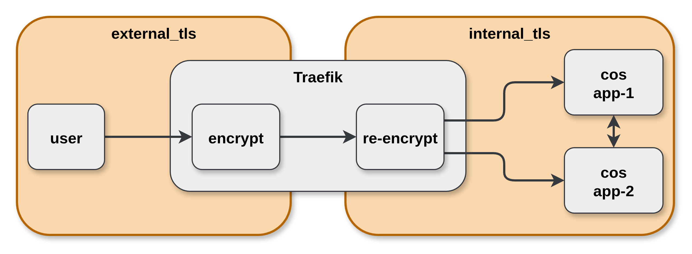

# TLS encryption in COS

Both COS and COS Lite, have 2 sections of the deployment (internal and external) which can implement TLS communication.

The combination of these 2 configurations provides our products with 4 modes of operation:
1. Both `external` and `internal` TLS communication, i.e. `full TLS encryption`
2. Only `external` TLS communication
3. Only `internal` TLS communication (default)
4. Neither `external` nor `internal` TLS communication, i.e. `unencrypted`



<!-- Edit this diagram here:
https://app.diagrams.net/?dark=auto#R%3Cmxfile%3E%3Cdiagram%20name%3D%22Page-1%22%20id%3D%2297916047-d0de-89f5-080d-49f4d83e522f%22%3E7VnbctowEP0aHunYFjb2YwJJ0zadaYdMA08dxRZGQViukLn06yvj9Q0ZQkshlzYv8a5Wa%2BmcPbqYFurNVu8FjiefeUBYyzKCVQv1W5ZldixH%2FUs968zjeF7mCAUNIKh0DOhPAk4DvAkNyLwWKDlnksZ1p8%2BjiPiy5sNC8GU9bMxZ%2Fa0xDonmGPiY5d53dum%2Fp4GcgN90vLLhhtBwAi93rW7W8ID9aSh4EsEbIx6RrGWG8zQwy%2FkEB3xZcaGrFuoJzmX2NFv1CEuBzTHL%2Bl3vaC2mIkgkD%2BkwDOjHy%2Ftpp538ENPB5fDD8iZo5xQsMEsADbKSRESYfZdsDiOX6xyqzVRJmtFsoctiSqkx5pEcQGRhZ1ybHWUviJBUgX7BaBgpp%2BRxmkIKPi1At9J%2BlLEeZ1xs3ojGOOhiv4istDx0HNtIM8MUVH6y2gmOWUCu6pjwGZFirUKgA%2BoAEFDCpgf2siwHywbfpFIJlgFODEUYFrlLLtQD0PEb1HgaMzT6B5lxDmAGGadi5vHavGuPXPcWffsUfyV9HLaXbdvRqLkTmIzp9PSsbHFANn9NHCAHeSgoONAAb6BlJwcdt86BAlxXR7eBA9M6lTqQBjUJ1KIOJhdywkOutHJVei%2FrZJQxtzyFduN8JFKugQWcSK5cEzlj0KoQFOuhMozcGKWG2j7A7K%2Bqjf01WLqU%2FEQsNiMxjuA0nfF%2BVSmAeCJ8iLJgb8UiJBCFmnkXhGFJF%2FXsTRxC1y9crU2VerHq9VKsrnmKbAjQa6sSimEcVByWJsVkTsTf1OGzKA7ZW4rr6oprEpxzKr11nkVvKyqHleeK2pRVii01cq29co0iXaPNe5B9pHIPrQakHxAjX6xj%2Beo1ZhtPa8w9p8a6L0dj1psW2R5F1aXXSNO5lNf4cvfl1Ej3f43spMk5U43sHWVlzRak%2FVaWbeeAo9FZl20dbZ%2Br%2B7kqAWSmFYvjuG2%2BBNiPuoe7W%2Ffw4rtWBXbvnLDrl3AdduvNwY7MZ4bd1Ev5jDtQefofVfecJzagcs8Z5fn%2BfAOaq8VfXqSfnZXDZ3g%2Bp37uvqYsH%2FG59ql92jj5Uab5%2Bu9uH6w9u54iG792%2FdcSeeaOpf7o7wjKLL%2B8Z%2BHlbxvo6hc%3D%3C%2Fdiagram%3E%3C%2Fmxfile%3E
-->

## Full TLS encryption implementation details

The recommended deployment for COS implements full TLS encryption, which requires an external certificates provider offer URL (cross-model relation) and has the following semantics:

- The external CA provides a certificate for Traefik's external URL.
- Within the COS model, workloads communicate via K8s FQDN URLs, except (on a case-by-case basis) when they have ingress relations
- COS charms generate CSRs with the K8s FQDN as the SAN DNS and the internal CA signs.
- All COS charms trust the internal CA by installing the CA certificate in the charm and workload containers, using the `update-ca-certificates` tool.
- Traefik establishes a secure connection with its proxied apps by trusting the local CA.

COS Lite with full TLS encryption is described in the diagram below. The diagram is limited to prometheus and alertmanager for brevity and clarity.

```{note}
This TLS diagram is relevant for COS as well, if prometheus is replaced with Mimir.
```

```{mermaid}
%%{init: { "theme": "dark" } }%%
flowchart TB
  subgraph COS [cos-model]
    traefik[traefik]
    prometheus[prometheus]
    alertmanager[alertmanager]
    localca[local-ca]
  end

  subgraph CAModel [ca-model]
    direction TB
    cert-provider[certificates provider]
  end

  subgraph ObserveModel [observable-model]
    grafana[grafana-agent]
  end

  grafana -->|"remote_write<br>(example.com)"| prometheus
  prometheus -->|"self-monitoring<br>(am-0.cluster.local)"| alertmanager
  cert-provider -->|"tls_certificates<br>(example.com)"| traefik
  traefik -->|"ingress-per-unit<br>(prom-0.cluster.local)"| prometheus
  traefik -->|"ingress-per-app<br>(am-*.cluster.local)"| alertmanager

  prometheus -->|"tls_certificates<br>(prom-0.cluster.local)"| localca
  alertmanager -->|"tls_certificates<br>(am-0.cluster.local)"| localca
  localca -->|"certificate_transfer<br>(local_ca)"| traefik

  cert-provider -->|"certificate_transfer<br>(external_ca)"| grafana

  classDef Charm stroke:white,stroke-width:1px,color:white,rx:8px,ry:8px
  class traefik,prometheus,alertmanager,localca,grafana,cert-provider Charm
```

As with any TLS configuration, keep in mind best practices such as frequent certificate rotation. See [this guide](https://charmhub.io/blackbox-exporter-k8s/docs/monitor-ssl-certificates) for an example of monitoring certificates.

```{warning} currently there is a [known issue](https://github.com/canonical/operator/issues/970) due to which some COS relations are limited to in-cluster relations only.
```

## Deployment

Using the following Terraform root module, you can control `external` and `internal` TLS. 

To enable `internal` TLS, set the `internal_tls` value to `true`. To enable `external` TLS, supply the `external_certificates_offer_url` value with a `certificates` provider's Juju offer URL, from the `ssc` module in this example. The combination of these settings enables full encryption.

```{Note}
If you are using COS Lite, create a cos-lite module with the cos-lite source: "git::https://github.com/canonical/observability-stack//terraform/cos-lite"

The [COS Lite bundle](https://charmhub.io/cos-lite) is now deprecated in favor of Terraform modules.
```

```{literalinclude} /how-to/cos-tls.tf
```
