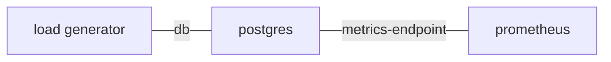
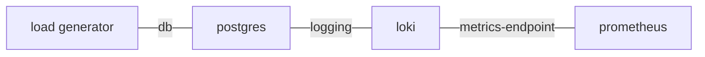

# How to evaluate the telemetry volume your workloads generate

The [resource requirements] for COS depend on the ingestion rate of telemetry.
In order to correctly size the VM(s) needed for COS, you need to know how much telemetry your workloads generate.


## Metrics rate
Have your deployment sending all metrics to Prometheus (or Mimir) and inspect the 48hr plot for `count({__name__=~".+"})`.
The raw data can also be obtained by querying the Prometheus `query` endpoint directly:

```bash
curl -s --data-urlencode 'query=count({__name__=~".+"})' ${PROM_UNIT_IP}:9090/api/v1/query"
```

Compare the output to the number of metrics exposed by individual applications.
For example, for the postgres charm,

```bash
juju ssh pg/0 curl localhost:9187/metrics | grep -v '^# ' | wc -l
```

Multiply this value by the scrape frequency (e.g. 1/min), to obtain metrics rate for the given application.

A simplified Juju relations diagram would look as follows:




## Logs rate
Have your deployment sending all logs to Loki, and inspect the 48hr plot for `loki_distributor_*_received_total`:

```
sum(rate(loki_distributor_bytes_received_total[5m]) / 1e9 * 60*60*24)
sum(rate(loki_distributor_lines_received_total[5m]) * 60)
````

Note that the `loki_distributor_*_received_total` metrics are generated by Loki. A convenient way to inspect them would
be to relate Loki to Prometheus.




## Sample collection script

```bash
#!/bin/bash

PROMQ="http://10.1.166.87:9090/api/v1/query"
PROMQR="http://10.1.166.87:9090/api/v1/query_range"

NOW=$(date +%s)
AGO2d=$((NOW - 60*60*24*2))

echo "Prometheus metric count now:"
curl -s --data-urlencode 'query=count({__name__=~".+"})' $PROMQ \
  | jq '.data.result[].value'

echo "Prometheus metric count in the last 48 hours (may include spikes):"
curl -s --data-urlencode 'query=count({__name__=~".+"})' \
  --data-urlencode "start=$AGO2d" \
  --data-urlencode "end=$NOW" \
  --data-urlencode 'step=1m' $PROMQR \
  | jq '.data.result[].values'

echo "Loki distributor approx Gi/day (extrapolated from a 5m window)"
curl -s --data-urlencode 'query=sum(rate(loki_distributor_bytes_received_total[5m]) / 1e9 * 60*60*24)' $PROMQ \
  | jq '.data.result[].value'

echo "Loki distributor lines/min received (extrapolated from a 5m window)"
curl -s --data-urlencode 'query=sum(rate(loki_distributor_lines_received_total[5m]) * 60)' $PROMQ \
  | jq '.data.result[].value'

echo "Loki distributor lines/min received in the last 48 hours (may include spikes)"
curl -s --data-urlencode 'query=sum(rate(loki_distributor_lines_received_total[5m]) * 60)' \
  --data-urlencode "start=$AGO2d" \
  --data-urlencode "end=$NOW" \
  --data-urlencode 'step=1m' $PROMQR \
  | jq '.data.result[].values'
```


## How to model the load when telemetry volume is not not constant
Applications may have many knobs and load patterns.
1. Pick a few of the most significant variables. One or two would be easiest to work with.
2. Conduct several experiments and record the logging rate and metrics rate as you change the variables.
3. Curve fit the results, e.g. `logs_rate = f1(x, y)`, `metrics_rate = f2(x, y)`, so your results could be used
   in a responsive sizing calculator.

Transient bursts may be ignored if they are one-offs (not periodic). Such bursts may be accounted for by a fixed margin.


[resource requirements]: https://discourse.charmhub.io/t/cos-lite-ingestion-limits-for-8cpu-16gb-ssd/13005
