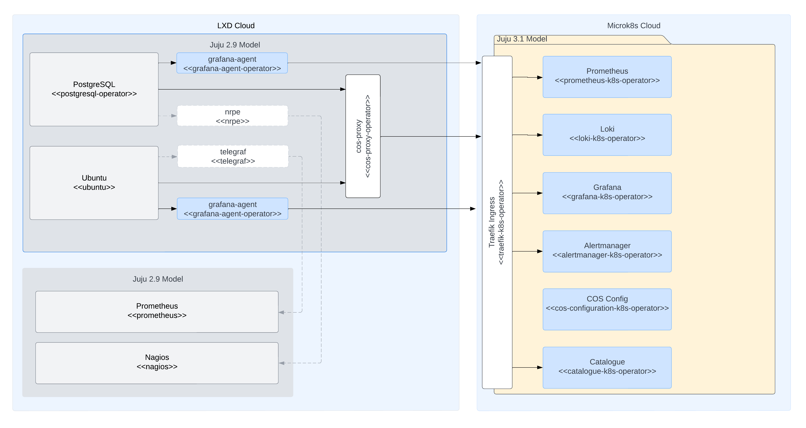

# Migrate from LMA to COS Lite

COS Lite is not a new version of LMA, but a completely new product that draws upon the lessons learned from LMA to create a heavily integrated,
mainly automated, turn-key observability stack. This means that there is no direct, in-place migration path.

```{warning}
This post describes how to migrate from LMA to COS with potentially destructive operations. Make sure you have up-to-date backups before attempting to migrate.
```

```{warning}
Refer to the [best practices guide](../reference/best-practices/best-practices-cos-lite) before migrating.
```

```{warning}
Refer to [Supported tracks](../reference/supported-tracks) to choose the right track for your needs.
Note that different tracks may have different ubuntu bases or minimum Juju version requirement.
```

Let's assume this is our, heavily simplified, existing environment:


## 1. Upgrade your existing Juju controller

COS Lite requires a Juju version `>=3.6`.
Consult the [juju-cross-version-compatibility](https://documentation.ubuntu.com/juju/latest/reference/juju/juju-cross-version-compatibility/) docs to ensure
your Juju controller is compatible before continuing.
If necessary, [upgrade the Juju controller](https://documentation.ubuntu.com/juju/latest/howto/manage-controllers/#upgrade-a-controller) accordingly.

## 2. Deploy COS Lite to an isolated MicroK8s instance

This model needs to be running Juju `>=3.6`. For instructions, see the [Deploy COS Lite on MicroK8s](../../tutorial/installation/cos-lite-microk8s-sandbox) tutorial.

It will now look somewhat like this:


## 3. Deploy `cos-proxy` and `grafana-agent` in your pre-existing model

Deploy [COS Proxy](https://charmhub.io/cos-proxy) in your existing model and 
wire it up to all the same targets as you would with LMA. cos-proxy is designed 
to bridge the gap between your current LMA-enabled charms that utilize Filebeat, NRPE, and COS, which utilizes Prometheus and Loki/Promtail. 

Then deploy [Grafana Agent](https://charmhub.io/grafana-agent), and relate it to all your principal charms.
You will need to make offers from the COS Lite model (if they are not already in place), for example:

```{bash}
juju offer grafana:grafana-dashboard
juju offer loki:logging
juju offer prometheus:receive-remote-write
```

And then consume them from the VM model, for example:

```{bash}
juju consume ck8s:admin/cos.grafana
juju consume ck8s:admin/cos.loki
juju consume ck8s:admin/cos.prometheus
```


By now, you will have something that looks a little something like this:



[COS Proxy](https://charmhub.io/cos-proxy) and [Grafana Agent](https://charmhub.io/grafana-agent) will continue to work on 
Juju 2.9 for the time being. This is mainly to support migrations from LMA 
to COS.

## 4. Evaluate solution parity

You'll now receive your telemetry in both LMA and COS. At this point, you should evaluate coverage for the checks and
alarms you're used to when using LMA in COS before deciding to decommission LMA. Specifically:

- Inspect the list of scrape jobs in Prometheus. These should match 1:1 to nrpe checks. Make sure they are all green (healthy).
- Inspect the list of nrpe alarms evaluated by Prometheus.
- Inspect the dashboards available in Grafana. There should be NRPE, Ceph and other dashboards. Confirm the data makes sense.

## 5. Decommission LMA

With COS Lite up and running, you can now start decommissioning your LMA setup. 

As it is a migration between solutions, none of your historical 
data, in LMA, will be migrated to COS. If this data is important,
retain pre-migration backups until they're no longer relevant.
