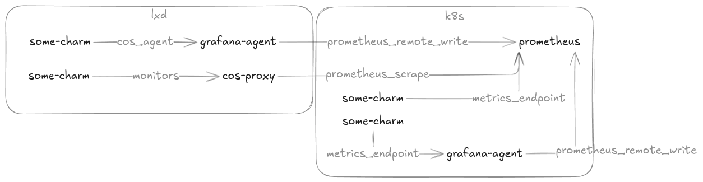

# Troubleshoot `HostHealth` alert rules

The `HostHealth` alert rule group contains both the `HostMetricsMissing` and the `HostDown` alert rules, identifying unreachable target scenarios.
These are generic (synthetically generated) alert rules, alleviating charm authors from having to implement their own `HostHealth` rules, per charm, reducing implementation error.

The `HostHealth` alert rule group is applicable to the following deployment scenarios:



## `HostDown` alert
The purpose of this alert is to notify when Prometheus (or Mimir) failed to scrape the target. The alert expression executes `up{...} < 1` with labels including the target's Juju topology: `juju_model`, `juju_application`, etc.

### Confirm the target is running
Use `juju ssh` to check if the workload is running:
- run `snap list` for machine charms
- run `pebble services` for k8s charms

### Inspect existing `up` timeseries
Perhaps the metrics *do* reach Prometheus, but the `expr` labels we have rendered in the alert do not match the actual metric labels. You can confirm by going to the Prometheus (or Grafana) UI and querying for `up`. Compare the set of labels you get for the returned `up` timeseries.


## `HostMetricsMissing` alert
The purpose of this alert is to notify when metrics are not reaching the Prometheus (or Mimir) database, regardless of whether scrape succeeded. The alert expression executes `absent(up{...})` with labels including the aggregator's Juju topology: `juju_model`, `juju_application`, etc. The `juju_unit` label is intentionally omitted.

```{note}
This alert is only applicable to clients (aggregators) that _push_ metrics via `remote-write`, such as `grafana-agent` or `opentelemetry-collector`.
```

### Confirm the aggregator is running
Use `juju ssh` to check if the workload is running:
- run `snap list` for machine charms
- run `pebble services` for k8s charms

### Confirm the backend is reachable
Use `juju ssh` to try and curl the Prometheus (or Mimir) api URL. If the host is unreachable, then this may indicate a network / firewall issue.

### Inspect existing `up` timeseries
Perhaps the metrics *do* reach Prometheus, but the `expr` labels we have rendered in the alert do not match the actual metric labels. You can confirm by going to the Prometheus (or Grafana) UI and querying for `up`. Compare the set of labels you get for the returned `up` timeseries.
