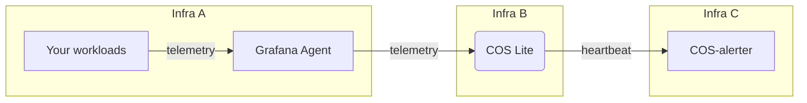

# Juju compatibility

COS Lite requires Juju 3.1 to function properly. It is able to observe applications that are on Juju 2.9, but COS Lite itself needs to be deployed on a model that is Juju 3.1+. To be able to set up cross-model, cross-controller relations with existing Juju controllers and models, we therefore recommend upgrading your existing controllers (with applications that are to be observed by COS Lite) either to the latest Juju 3 version (at the time of writing 3.1.5), or to the latest version in the 2.9 track (at the time of writing: 2.9.44).

# Topology and infra

This is the recommended deployment topology for COS-Lite:



## Use COS Alerter
Apart from COS Lite itself, [COS Alerter](https://github.com/canonical/cos-alerter) should be deployed to let operators know whenever the routing of notifications from COS Lite stops working, preventing a false sense of security.


## Deploy in isolation
COS Lite should at the very least be deployed in its own Juju model, but preferably even on a separate substrate with a dedicated Juju controller.

Similarly, we advise to deploy COS-alerter on dedicated infra.

These precautions help to limit the blast radius in case of outages in the workloads you observe, or the observability stack itself. For COS-lite, we **strongly** recommend using [a separate three-node Microk8s cluster](https://microk8s.io/docs/high-availability).


## Avoid pulling data cross-model

Cross-model relations using the `prometheus_scrape` interface should be avoided. Instead, deploy a Grafana agent in each of the models you want to observe and let the agents be a fan-in point pushing the data to COS. This makes for a less error-prone networking topology that is easier to reason about, especially at scale.

# Networking

## Ingress

MetalLB, or an equivalent load balancer, should be configured on the Kubernetes environment COS is running on. As part of the COS Lite bundle, Traefik is deployed and configured to provide network ingressing for the bundle components. Make sure the load balancer provides Traefik with **a static IP**, or some other identity that remains stable over time.

## Egress
Some charms require external connectivity for the COS Lite bundle to function correctly.

As a common requirement, the environment should be able to reach:
* Charmhub;
* the Juju registry;
* Snapcraft.

There are other charm-specific URLs that some charms access by default:
* https://objects.githubusercontent.com/, needed by [Loki](https://charmhub.io/loki-k8s#network-requirements-9);
* stats.grafana.org, needed by [Grafana](https://charmhub.io/grafana-k8s/docs/network-requirements) and [Grafana Agent](https://charmhub.io/grafana-agent-k8s#network-requirements-5).

To disable the functionalities that require those URLs, please refer to linked docs for the relevant charms.

## Controller routing

If the network topology is anything other than flat, the Juju controllers will need to be bootstrapped with `--controller-external-ips`, `--controller-external-name`, or both, so that the controllers are able to communicate over routable identities for your cross--controller relations. For example:

```
juju bootstrap microk8s uk8s \
  --config controller-service-type=loadbalancer \
  --config controller-external-ips=[10.0.0.2]
```

Note that these config values can only be set at bootstrap time, and are read-only thereafter.

# Storage

## Set up distributed storage
[note]
Note: **Do not** use the [`hostpath-storage`](https://microk8s.io/docs/addon-hostpath-storage) microk8s addon in production:
 * `PersistentVolumeClaims` created by the hostpath storage provisioner are bound to the local node, so it is *impossible to move them to a different node*.
 * A hostpath volume can *grow beyond the capacity set in the volume claim manifest*.

Instead, you could use the [`rook-ceph`](https://microk8s.io/docs/addon-rook-ceph) addon together with microceph. See the [microceph tutorial](https://charmhub.io/cos-lite/docs/tutorials/distributed-storage?channel=latest/edge).
[/note]

## Storage volume

You should come up with an appropriate [storage overlay](https://github.com/canonical/cos-lite-bundle/blob/main/overlays/storage-small-overlay.yaml) for your use case. For example, a deployment that handles roughly:

- 1M samples/min with 150 targets
- 100k loglines/min for about 150 targets

has a growth rate of about 50GB per day under normal operations. So, if you want a retention interval of about two months, you’ll need 3TB of storage only for the telemetry.

# Maintenance
Before restarting a Kubernetes node with COS applications on it, you should cordon and drain it so that the StatefulSets are moved to another node. This process will ensure the least amount of downtime.

In the event that a node goes down unexpectedly and cannot be recovered, you can manually recover the COS units by force deleting the pod and any volumeattachments that existed on the inaccessible node. The pods will then be rescheduled to a working node.

## Known issues
- High availability during maintenance is only possible on clusters utilizing distributed storage, such as MicroCeph.
- All of the COS applications use StatefulSets, so these pods will not self-heal and deploy to another node automatically.
- The juju controller needs to be up for COS pods to start, otherwise their charm container will fail, causing the pod to go into a crash loop.

# Upgrading
Remember to `juju refresh` with `--trust`. If omitted, you would need to `juju trust X --scope=cluster`.