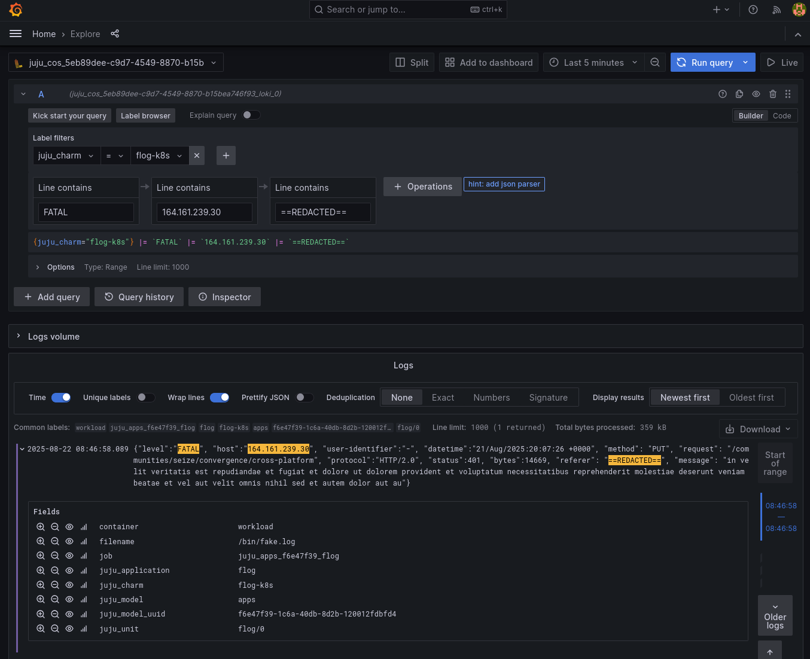

# Redact sensitive data

## Introduction

For applications that deal with sensitive, private data, the ability to mask certain information in their logs is important, in some cases required.
As OpentelemetryCollector charm serves as the entry point for log data, it can mask logs before they are sent to Loki or another destination.


## Deployment scenario

Let's imagine a deployment with `flog` and `otelcol` in one Juju model, where `flog` sends its logs to Loki through `otelcol`.

```{mermaid}
flowchart LR
	subgraph s1["COS"]
		Loki
	end
	subgraph s2["My Model"]
		flog
		otelcol
	end

	flog -- loki_push_api --> otelcol
	otelcol -- loki_push_api --> Loki
```

A concrete Juju example of that deployment with redaction in `otelcol` would be:

```shell
Model  Controller  Cloud/Region        Version  SLA          Timestamp
apps   microk8s    microk8s/localhost  3.6.8    unsupported  20:00:30-03:00

SAAS          Status  Store     URL
loki-logging  active  microk8s  admin/cos.loki-logging

App      Version  Status   Scale  Charm                        Channel      Rev  Address        Exposed  Message
flog              active       1  flog-k8s                     latest/edge    9  10.152.183.89  no
otelcol           active       1  opentelemetry-collector-k8s  2/edge        75  10.152.183.40  no

Unit        Workload  Agent  Address       Ports  Message
flog/0*     active    idle   10.1.167.123
otelcol/0*  active    idle   10.1.167.68

Integration provider       Requirer                Interface      Type     Message
loki-logging:logging       otelcol:send-loki-logs  loki_push_api  regular
otelcol:receive-loki-logs  flog:log-proxy          loki_push_api  regular

## Logs produced by `flog`

The logs produced by `flog` are in JSON format and have the following fields. Of all the logs generated by the application, let's take one of them, for instance this one:

```shell
root@flog-0:/# cat /bin/fake.log | grep FATAL | grep "164.161.239.30"

{"level":"FATAL", "host":"164.161.239.30", "user-identifier":"-", "datetime":"21/Aug/2025:20:07:26 +0000", "method": "PUT", "request": "/communities/seize/convergence/cross-platform", "protocol":"HTTP/2.0", "status":401, "bytes":14669, "referer": "http://www.seniorusers.info/leading-edge", "message": "in velit veritatis est repudiandae et fugiat et dolore ut dolorem provident et voluptatum necessitatibus reprehenderit molestiae deserunt veniam beatae et vel aut velit omnis nihil sed et autem dolor aut au"}
```

Now imagine that for privacy purposes we need to redact the `referer` field. In this concrete example, redacting the `referer` field means replacing its value: `http://www.seniorusers.info/leading-edge` with something like `==REDACTED==` before sending this log to loki.

## `otelcol` configuration

In order to redact logs we use the [`transform`](https://github.com/open-telemetry/opentelemetry-collector-contrib/tree/main/processor/transformprocessor#transform-processor) processor.

To achieve this, the processor need to be configured like this:

```yaml
processors:
  transform:
    error_mode: ignore
    log_statements:
    - replace_pattern(log.body, "http[s]*://.*\",", "==REDACTED==\",")
```

Besides this configuration, the `transform` processor must be added to the logs pipeline:

```yaml
service:
  pipelines:
    logs:
      exporters:
      - loki/0
      processors:
      - resource
      - attributes
      - transform
      receivers:
      - otlp
      - loki
```

Since we are in the context of a Juju deployment, none of these changes should be done manually. The `OpentelemetryCollector` charm provides a simple way to do this.

A file, say `transform.yaml`,  with the specific config for the transform processor needs to be created.

```yaml
transform:
  error_mode: ignore
  log_statements:
    - replace_pattern(log.body, "http[s]*://.*\",", "==REDACTED==\",")
```

Now let's configure `otelcol` application using this file:

```shell
juju config otelcol processors=@transform.yaml
```

Once this config is applied, we can verify in Grafana, that our concrete log:

```json
{"level":"FATAL", "host":"164.161.239.30", "user-identifier":"-", "datetime":"21/Aug/2025:20:07:26 +0000", "method": "PUT", "request": "/communities/seize/convergence/cross-platform", "protocol":"HTTP/2.0", "status":401, "bytes":14669, "referer": "http://www.seniorusers.info/leading-edge", "message": "in velit veritatis est repudiandae et fugiat et dolore ut dolorem provident et voluptatum necessitatibus reprehenderit molestiae deserunt veniam beatae et vel aut velit omnis nihil sed et autem dolor aut au"}
```

has been redacted:


